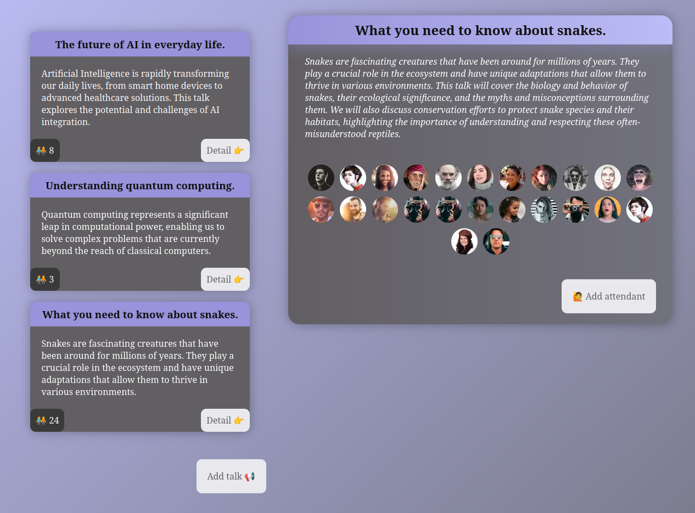

# Project's purpose

This is a dummy project whose purpose is to build components and manage state. The only React features allowed to be used is useState and components.

# Features

1. Starts with 3 default talks and the information of their attendants.
1. Details of a talk shows longer description and form to add attendants.
1. New talks can be added using a form.
   - Title
   - Description: If it is greater than 70 characters, then automatically creates a short description via trimming it and adding "..." at the end.
1. New attendants can be added.
   - Default image text to retrieve one from the web.

# Info

- Color palette: https://coolors.co/bbbdf6-9893da-797a9e-72727e-625f63
- This project is not meant to be 100% responsive.
- This project is not meant to solve a real life problem.

# Project screenshot

